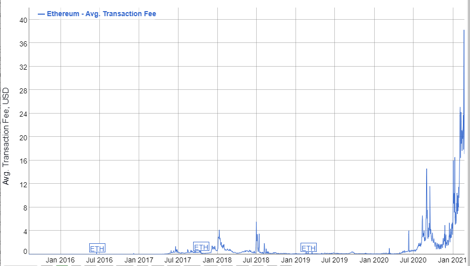

# Lite Paper

**Abstract:** The ZenChain Foundation is developing ZenChain, a blockchain specifically dedicated to decentralized financial \(DEFI\) applications and non-fungible tokens \(NFTs\). By focusing on the functionality of the blockchain and dedicating it specifically to DEFI and NFTs, ZenChain provides unparalleled high transaction throughput, reduced risk of errors, and intelligent feature development specifically for the fulfillment of financial services for both fungible token and non-fungible token \(NFT\) on the blockchain.

**This Document is not a Prospectus:** This document does not constitute nor imply a prospectus of any sort. No wording contained herein should be construed as a solicitation for investment. Accordingly, this whitepaper does not pertain in any way to an offering of securities in any jurisdiction worldwide whatsoever. Rather, this whitepaper constitutes a technical description of the functionality of the Cake products and the development and distribution of ZenChain.

**This Document is not a final technical specification:** This document does not constitute nor imply a final technical specification of ZenChain. Information presented on this whitepaper, technical or otherwise, is meant to outline the general idea of ZenChain, its design, and its use-cases and is subject to change with or without notice. For the latest up-to-date technical specification, check out the updates and documentation on the official website [https://zenchain.co](https://zenchain.co/).

## Overview

The cryptocurrency industry is based on a simple premise: people should be fully in control of their finances. While it seems like a simple and obvious statement, the current systems are far from providing financial services that are truly under the control of the people who use them. The mission of ZenChain is to give people \(and in the future, machines, and devices\) seamless access to decentralized finance \(DeFi\) with special non-fungible tokens \(NFTs\). For that purpose, we are introducing ZenChain, a dedicated blockchain specifically for decentralized finance \(DeFi\) with special for non-fungible tokens \(NFTs\).

ZenChain approaches decentralized finance as a specific and critical segment of the blockchain community. ZenChain is a dedicated blockchain that is optimized specifically for DeFi and NFT applications. ZenChan does contain all core DeFi applications built in the core of the chain, not written by smart contracts like swap, lending, and insurance dapp. ZenChain also contains all applications supported for NFTs like minting, auctions, and trading. And special, with ZenChain, your NFTs can use it as collateral in Defi to make a loan or staking in a pool to earn extra token …

## The problem

Cryptocurrency and Decentralized Finance \(DeFi\) offer a way to start with a new system, circumventing the difficulties faced in changing the finance industry. While crypto has attracted billions in investments, decentralized financial services are lagging. When it comes to investment in cryptocurrency, crypto investors can buy and sell, but that’s it. The cryptocurrency itself cannot be invested in the same way fiat currency can be. Initial attempts to create peer-to-peer lending and asset tokenization so far have proven partial and unreliable, so investors have extremely limited options when it comes to an investment of their crypto assets. The potential is enormous to provide financial services in crypto, the same way they are offered in fiat currency.

First, we must be clear about what DeFi is. DeFi, in its ideal form, exhibits four properties.

* First, non-custodial financial services allow participants to exert full control over their funds at any point in time.
* Second, the permissionless nature of DeFi allows anyone to interact with financial services without being able to be censored or blocked access by a third party.
* Third, DeFi is openly auditable, which means that anyone can audit the state of protocols-e.g., that they are fully collateralized/healthy.
* Fourth, financial services can be arbitrarily composed such that new financial products and services can be created similar to how one can conceive new Lego models based on a few basic building blocks.

DeFi has grown rapidly, going from around 600m USD in total value locked \(TVL\) at the start of 2020 to over 42bnUSD as of February 2021, with the most capitalized use cases being collateralized lending, constituting c.48% of the TVL, and decentralized exchange \(DEXs\), constituting c.34% of the TVL as of January 2021 \[2\]. In turn, this rise led to the 24 hour volume on a decentralized crypto asset exchange \[3\], overtaking that of a major centralized crypto-asset exchange \[4\] for the first time \[5\].

_\(Total value locked in Defi - Defipulse\)_

Yet, as with any nascent technology, the evolution of DeFi is not without its risks. In the last year alone, DeFi has experienced more than 20 major protocol exploits, resulting in a loss of funds amounting to over 130m USD \[6\]. An apparent willingness of market participants to take large financial risks coupled with the possibility of any actor writing unaudited and even malicious smart contracts—precisely due to the decentralized nature of such technologies—renders the risks particularly acute. Moreover, due in part to the emergent complexity of smart contracts once composed together, there are even several instances \(e.g., \[7\], \[8\], \[9\], \[10\], \[11\]\) of audited protocols being exploited, rendering the audit process an imperfect defense against exploits.

Moreover, at a technical level, the blockchains underlying DeFi are facing significant challenges. Blockchain transaction fees have risen considerably during periods of congestion, with the fees for relatively simple smart contract operations running into the hundreds of dollars. Rising transaction costs price out small transactions, in turn restricting the set of transaction types for which the layer-one blockchain can be used.

[_\(https://bitinfocharts.com/comparison/ethereum-transactionfees.html\)_](https://bitinfocharts.com/comparison/ethereum-transactionfees.html%29)

In conclusion, since over 90% of DeFi projects are based on Ethereum blockchain, we will consider the challenges for Ethereum challenges as DeFi challenges:

**Scalability**

Another big problem with DeFi projects is the scalability of the host blockchain. Two major problems arise from the scalability problem:

* Transactions take a long time to be confirmed
* The transaction is extremely expensive at times of congestion

Ethereum at full capacity can process about 13 transactions per second, while centralized counterparts can process thousands and thousands of transactions. 

**Smart Contract Problems**

Smart contract vulnerability is a major source of issues for many DeFi projects. If there is the slightest flaw in the code of a smart contract, it can lead to loss of funds.

**Low Interoperability**

There are different types of blockchains such as Bitcoin, Ethereum, Binance Smart Chain, each with its DeFi ecosystem and community. Interoperability enables DeFi platforms, tools, DApps, and smart contracts on different blockchains to interact with each other. Until this becomes simpler, many projects are siloed.

**Lack of Insurance**

Insurance protects investors in the event of hacks or other fraudulent activities. Insurance plays a very important role in centralized finance while it is much rarer in DeFi.

## ZenChain solution

ZenChain gives some solution to resolve this problem:

- Scalable, high-throughput Blockchain with Tendermint Power

- Bridge from Etherum, Tron, Binance smart chain make cross-chain Defi and NFTs solutions.

- Decentralized pricing oracles built-in

- DeFi primitives built-in: Dex, Lending & Borrowing, token IDO, insurance.

- Non-fungible Token applications like a mint, auction, rent NFTs

- NFTs X DEFI: bring the power of NFTs to Defi ecosystem and Defi to NFTs.

### Scalable, high-throughput Blockchain

ZenChain is a scalable, high-throughput Proof-of-Stake blockchain that is fully compatible and interoperable with Ethereum. It is built using the Cosmos SDK which runs on top of the Tendermint Core consensus engine.

ZenChain allows for running vanilla Ethereum as a Cosmos application-specific blockchain. This allows developers to have all the desired features of Ethereum, while at the same time, benefit from Tendermint’s PoS implementation. Also, because it is built on top of the Cosmos SDK, it will be able to exchange value with the rest of the Cosmos Ecosystem through the Inter Blockchain Communication Protocol \(IBC\).

Here’s a glance at some of the key features of Zen Chain:

* Web3 compatibility
* High throughput via Tendermint Core
* Horizontal scalability via IBC
* Fast transaction finality

ZenChain enables these key features through:

* Implementing Tendermint Core's ABCI application interface to manage the blockchain
* Leveraging modules and other mechanisms implemented by the Cosmos SDK
* Utilizing geth as a library to avoid code reuse and improve maintainability.
* Exposing a fully compatible Web3 RPC layer for interacting with existing Ethereum clients and tooling \(Metamask, Remix, Truffle, etc\).

The sum of these features allows developers to leverage existing Ethereum ecosystem tooling and software to seamlessly deploy smart contracts which interact with the rest of the Cosmos ecosystem.

### Cross-chain solutions

ZenChain is two types of solution to allow token transfer across exits public blockchain:

* Bridge solution: Two way connect between ZenChain and Etherum, Polkadot, Binance SmartChain, Tron .. and more chain with ZenBridge module
* IBC solution: Two-way connect between ZenChain and Cosmos family blockchain using Inter-blockchain Communication protocols.

#### Bridge from Etherum, Polkadot, Binance smart chain, Tron, and more ...

 ZenBridge is ZenChain &lt;-&gt; Etherum, Polkadot, Binance smart chain, Tron, and more chain ... bridge designed to run on the ZenChain focused on maximum design simplicity and efficiency. The bridge can transfer tokens \(ETH, ERC20, DOT, TRX, TRC20, BEP20 ... \) two-way between Ethereum, Polkadot, Binance smart chain, Tron ... to a ZenChain.

**The design of Gravity Bridge**

Validators are fully trusted to manage the bridge. Validator powers and votes are replicated on the Ethereum, Polkadot, Tron, Binance smart chain side so trust in bridge assets depends entirely on trust in the validator set of the peg zone chain. This has known problems where the assets in the bridge exceed the market cap of the native token. We accept these known issues in exchange for the dramatic design simplification combined with acceptable decentralization this design provides.

The ZenBridge Ethereum, Polkadot, Tron, Binance smart chain contract only supports ERC20, TRC20, BEP20 transfers and not arbitrary data. This helps keep the contract simple enough to optimize heavily and reach production quality quickly.

Peg zone validators must maintain a trusted Ethereum, Polkadot, Tron, Binance smart chain node. This removes all trust and game theory implications that usually arise from independent relayers, once again dramatically simplifying the design.

On a high level, the transfer flow for transferring a token to the is as follows:

* The user sends the token \(ERC-20, TRX20, BEP20, DOT\) to the Zen Bridge Contract was deployed on each chain, emitting a LogLock event.
* A ZenBridge relayer listening to the event creates and signs a Tendermint transaction encoding this information which is then broadcasted to the Zen Chain.
* The nodes of the Zen Chain verify the validity of the transaction.
* New tokens representing the ERC-20, TRX20, BEP20, DOT are minted in the bank module of ZenChain

Thereafter, the ERC-20 can be used on Zen Chain's EVM as well as in the Cosmos-SDK-based application logic of the Zen Chain.

#### Inter-blockchain Communication Protocol \(IBC\)‌

In the future, the zen chain will support cross-chain transfers using [Tendermint IBC](https://tendermint.com/ibc/).

### Decentralized oracles

All blockchain platforms that operate and execute code trust in smart contracts suffer from the same centralizing issues that arise when needing to use external data points. Many decentralized systems rely on being able to perform basic tasks and computations that require external data feed such as asset price, inter-chain communications, real-world events, and external web API interactions.

Smart contracts cannot access data by themselves – there is no simple and intuitive query interface for decentralized applications to receive real-world data. Until Decentralized applications can interface real-world external data inputs into simple function calls, there will be significant barriers in the adoption of the technology and the accessibility for developers to realize new applications. Existing data availability solutions for blockchain smart contracts either depend on highly critical central points of failure or are subject to asynchronous interactions, which cause delays and complicate the smart contract logic.

An oracle is a mechanism for importing off-chain data into the blockchain virtual machine so that it is readable by smart contracts. This includes, for instance, prices of off-chain assets, such as ETH/USD, or off-chain information needed to verify outcomes of prediction markets, and is relied upon by various Defi protocols \(e.g. \[35\], \[36\], \[37\], \[38\], \[39\]\). Such data is not natively accessible on-chain.

###  DeFi primitives built-in

The initial Defi primitives set includes:

* Decentralized exchanges
* Stable coin
* Lending
* Insurance
* Token IDO pool

#### Decentralized exchanges

Based on the mechanism for price discovery, DEXs come in different variants, such as order book DEXs \(including individual \[60\], \[57\] and batch settlement \[61\], \[62\]\) and automated market makers \(AMMs\) \(e.g., \[63\], \[64\], \[65\]\).

The module features an AMM model combined with order books, multi-block batches, and limit orders to bring high-quality liquidity to the ZenChain

We propose a Hybrid Exchange model that combines a batch-based order book matching algorithm with an AMM-based methodology such that:

* Orders are accumulated in the order book
* At every batch execution height, the order book is processed using a matching engine
* The liquidity pool participates in the matching process using the equivalent swap price model

Also, the proposed model

* Permits limit orders that stay in the order book until they are filled or canceled. Indeed, they can remain open over multiple batches
* Allows partial filling of orders in the case where order price is equal to swap price.

**Batch Execution**

To address the issues related to order execution, it is proposed to use a Batch Execution method-ology. This follows a proposal outlined by \(Pourpouneh, Nielsen, and Ross 2020\), which is called "batch auction”

An alternative market solution is a DEX with discrete clearing as opposed to continuous clear-ing - a so-called "batch auction.” The frequent batch auction provides all buyers and sellers with the same trading opportunities by removing the randomness from the speed of processing the orders. Instead of focusing on getting first in line to trade at a given price, buyers and sellers are allowed to submit numerous contingent bids and ask that all enter the same double auction within a given time window. The batch auction has been put forward to address the front-running problem caused by High-Frequency Trading \(HFT\) on traditional financial exchanges \(Budish et al. 2014\). In crypto, the batch auction can solve some problems. The front running problem is addressed directly as all bids and asks are treated equally. As each batch can include as many bids and asks as needed, performance limitations can be captured by the time window.

In batch execution, orders are accumulated in a liquidity pool for a predefined period, which can be one or more blocks in length. Orders are then added to the pool and executed at the end of the batch.

In our model, there are two key features:

• Unexecuted orders from the batch remain in the order book to be executed in a future batch

• The batch period can be changed to reflect market conditions. For example, the batch period can be lengthened when there exists a significant price change due to high order volumes. An extended batch period invites more traders to participate in price discovery, which results in a more balanced and stable process. This is similar to the "dynamic closing” or "extended bidding” models used in many online auction platforms \("Auction Terminology” 2020\).

As \(Pourpouneh, Nielsen, and Ross 2020\) mentions, for a DEX, batch execution prevents front-running and collusion between miners/validators and traders, resulting in a fairer trading environment for all.

**Order Matching Rules**

The model allows fractional and full matching of orders based on the following criteria:

• Swap orders from X to Y

- If order price &gt; swap price then the order must be fully matched

- If order price == swap price then the order can be fully/fractionally matched

- If order price &lt; swap price then the order must not be matched at all

• Swap orders from Y to X

- If order price &lt; swap price then the order must be fully matched

- If order price == swap price then the order can be fully/fractionally matched

- If order price &gt; swap price then the order must not be matched at all

The liquidity pool contributes liquidity to order matching through the Equivalent Swap Price Model.

**Equivalent Swap Price Model**

Constant Product Equation: RxRy = k where Rx and Ry represent the reserve amount of different two tokens \(x and y\) and k is constant such that k &gt; 0.

This product remains constant during the token swap process such that for time t+1.

From this, it is observed that when a user places an order of tokens

Where the effective swap price ps is the swap price. Rearranging this gives

However, the new pool price pp is

The implication of the above equations implies that the post-swap pool price is different from the swap price. This price inconsistency causes several effects:

* Repeated price swing attracts more arbitrage opportunities than what AMM needs for real-time price discovery
* Excessive arbitrage opportunities in AMM will cause more loss to pool investors and traders

_\(Inefficient Price Discovery By Constant Product Model\)_

The Constant Product Model results in differences between the Swap Price and Pool price after execution. This creates an issue when using an order book with the liquidity pool since there will be a difference between the swap price in the order book and the price offered by the liquidity pool. To address this, the swap price calculation is redefined, so that swap price and post-swap pool price are equivalent:

Solving the above equation for SwapPrice ps yields

Compared to the Constant Product Model, the Equivalent Swap Price Model reduces the arbitrage opportunity because the pool price lands precisely on the last swap price.

_\(Efficient Price Discovery By Equivalent Swap PriceModel\)_

However, it should be noted that the result of this price equivalence is that the Constant Product Formula does not hold. This means that the liquidity pool balance is path-dependent. This model decides the number of orders provided by the liquidity pool for a given swap price

_\(Demand and Supply\)_

#### Lending and borrowing

Lending and borrowing of on-chain assets are facilitated through protocols for loanable funds \(PLFs\) \[76\], \[77\], which refer to DeFi lending protocols that establish distributed ledger-based markets for loanable funds of crypto assets. In the context of a PLF, a market refers to the total supplied and total borrowed amounts of a token, where the available \(i.e., non-borrowed\) deposits make up a market's liquidity. Unlike peer-to-peer lending, where funds are directly lent between individual agents, in a PLF, deposits for a given token market are pooled together in a smart contract. An agent may directly borrow against the smart contract reserves, assuming the market for the token is sufficiently liquid.

The cost of borrowing in a PLF is given by an interest rate charged to the borrower, which is determined by a market's underlying interest rate model. These interest rate models tend to reflect the notion that as liquidity becomes scarcer, a higher interest rate should encourage current borrowers to repay their debts while incentivizing holders of excess deposits to supply these.

In exchange for depositing funds, a depositor receives a derivative token reflecting his share of the total supplied funds in a market. As interest paid by borrowers is generally retained by the smart contract, the relative share of total funds in a market of a derivative token holder will increase over time. Accrued interest in a market is thereby paid out to the market's depositors as compensation for providing liquidity, while a reserve fraction is retained from the paid out interest by the protocol to protect against periods of illiquidity \[80\] and market stress.

For lending and borrowing running we using:

**Interest Index:**

The history of each interest rate, for each money market, is captured by an Interest Rate Index, which is calculated each time an interest rate changes, resulting from lending, borrowing, repaying, liquidity assets.

Each time a transaction occurs, the Interest Rate Index for the asset is updated to compound the interest since the prior index, using the interest for the period, denominated by r \* t, calculated using a per-block interest rate:

**Interest Rate Logics**

**Borrowing interest**

Interest rates for borrowing are set algorithmically based on supply and demand.

As Demand increases, the interest rates go up, as Supply increases, the interest rates go down.

As lending increases, the interest rates go down. The equations that we use for interest rate are similar to the following:

_**Example:**_

_When no one borrows: Borrows Interest = MinRate_

_When half of the lending pool is borrowed: Borrow Interest = MinRate + AdjustRate/2._

_When all of the lending pool is borrowed \(Bull market\): Borrow Interest will so high = MinRate + AdjustRate_

**Lending interest**

In basic, all borrowing interest generated by this protocol will transfer to the lending user with a small fee for reserve in protocols \(first, we set it to 0.5%\)

_**Example:**_

_When no one borrows: Lending Interest = 0_

_When half of the lending pool is borrowed: Lending Interest = BorrowInterest\*95%/2_

_When all of the lending pool is borrowed \(Bull market\): Lending Interest will so high = BorrowInterest \* 95%._

#### Stable coin

Non-custodial stable coins are crypto-assets that aim to be price stable relative to a target currency, commonly the USD and seek to achieve this via additional economic mechanisms. The core components of a non-custodial stable __coin are as follows \[40\].

**• Collateral.** This is the store of primary value for a stable coin. Collateral can be zETH, zBTC, or ZEN token.

**• Agents.** Agents form at least two roles in a non-custodial stable coin: \(i\) risk absorption, for instance by providing collateral that is intended to absorb price risk, and \(ii\) stable coin users.

**• Governance.** A mechanism and set of parameters that governs the protocol as a whole \(either performed by agents or algorithmically\).

**• Issuance.** A mechanism to control the issuance of stable-coins against or using the collateral \(either performed by agents or algorithmically\).

**• Oracles.** A mechanism to import data external to the blockchain onto the blockchain, such as price-feeds.

#### Token IDO

ZenChain Token IDO is a decentralized incubator that helps promising projects achieve their full potential by leveraging the investment power and buzz-making potential of our community.

We aim to democratize access to investment opportunities that were previously available only to well-heeled investors and venture funds, opening up the closed ecosystem of early-stage crypto project investments to everybody.

 The platform allows cryptocurrency projects to raise funds by setting up a swap pool based on a fixed purchase rate for tokens. These so-called “Fixed Swap Pools” have many advantages for token sale investors over traditional fundraising models like ICOs, IEOs, and IDOs \(Initial DEX Offerings\). Fixed Swap Pools will maintain the token price throughout the sale until the initial supply is bought.

With ZenChain Token IDO, decentralized projects will be able to raise and exchange capital cheap and fast. Users will be able to participate in a secure and compliant environment and to use assets that go way beyond the current ERC20 standard.

### Non-fungible Token applications

#### Minting

With ZenChain, artist, influencer, game production, defi dapp can easily make their NFTs with blade speed.

Because we know the artist or influencer focuses on their amazing job. ZenChain will bring them an easy and secure way to mint, manage their own NFTs with the power of blockchain.

#### Auction

ZenChain Auction is the marketplace for user-owned digital goods, which include collectibles, gaming items, domain names, digital art, and other assets backed by a blockchain.

A core part of our vision is that open protocols like Ethereum and interoperable standards like ERC721 and ERC1155 will enable vibrant new economies where users truly own this powerful brand new type of digital item. Because we think open, liquid marketplaces will help power these new economies, we're building tools that allow any developer to build rich, integrated marketplaces for their digital assets. And we're doing this with the help of a community of passionate users, developers, and creators.

#### Rent

With the Rent market, NFTs owners don’t need to sell their NFTs, just using them for rent. The renter can rent NFT in a short time to use in some special situations. Example: With some games, users rent NFTs as wearable items to join some special campaign, after they can pay back NFTs with a small fee, they don’t need to buy NFT at a higher price.

### NFTs X DEFI

#### Using NFTs as collateral in Defi

The special of ZenChain is full support cross-chain NFTs and Defi. ZenChain allows NFTs owners to get more powerful with their NFTs, is just not collectible, user can stake their NFTs as collateral in lending & borrowing application, and can borrow some fungible token \(ERC20, BEP20, TRC20 …\) to using another defi strategy.

The price of NFTs is determined by the Auction system. That means just users and NFTs which using the ZenChain auction system can use their NFTs as collateral.

ZenChain allows users to borrow up to 50% of the highest auction price.

#### Using Defi to mint NFT-Fi

NFT-Fi is a non-fungible token with defi traits and be minted by providing liquid to DEX or Lending systems. Imaging this is pear or level up items in traditional games, with the NFTs your power in Defi will be upgraded and make you have some special benefit than others that don't have any NFT-Fi. Or another word, you can imagine NFT-Fi like a loyalty card or coupon.

Here is some NFT-Fi will be mint with ZenChain:

* **Fee master:** if a user uses or holds these NFTs when using Defi, users can use DEX and another defi with fee benefit. Each Fee master type NFT has special traits: percent decrease fee, time to use, period, the scope of token …
* **Interest King:** if a user uses or holds these NFTs when using Defi, users can earn more LP fee in Dex \(normal is 0.03%\), or users can earn more lending interest, or reduce borrow interest. Each Interest King token has special traits: percent increase or decrease fee, time to use, period, scope of token …
* **Lucky Pass:** if a user uses or holds these NFTs when using Defi, users can have change to mint more NFT-Fi token … To be fair, ZenChain has Random Number Generator power by Oracle module.
* 

## Benefits of ZenChain

* Development of key applications for the DEFI and NFTs.
* High throughput for all transactions
* Safer, more secure blockchain specifically for decentralized finance.
* The rapid development of dApps for decentralized finance.
* Peace of mind that the blockchain is not used for any types of non-financial dApps, thus decisions of Foundation and core developers are focused 100% on decentralized financial use-cases and nothing else.
* The rapid development of dApps with dedicated calls specifically for finance applications.
* The minimal attack surface of financial smart contracts developed on the platform.
* Reliable governance
* Highly immutable – by periodic anchoring to the blockchain.

## Milestones

**2021 Q2**

Release of public Testnet V1.

Launch of BIP-20 token.

Release blockchain explorer

Implementation of bridges to Ethereum, Tron, Binance SmartChain on Testnet

Release of Incentivized Staking Competition and bridge.

Release NFT mint, auction, rent application Testnet

Release Dex Testnet

Release Lend and borrow Testnet

**2021 Q3**

Launch of Mainnet V1.

Swapping of the token, from BIP-20 to native chain.

Implementation of bridges to Polkadot on Testnet

Implementation of bridges to multiple blockchain networks main net

Release NFT mint, auction, rent application Mainnet

Adding staking incentives.

**2021 Q4**

Release Dex Mainnet

Release Lend and borrow Mainnet

Adding liquidity mining \(Dex, Lending\) incentives.

**2022 Q1**

Launch of cross-chain yield generation.

## Token sales and economics

### Token allocation

| **Token Name** | **ZEN** |
| :--- | :--- |
| Public IDO | 5% of the total token supply |
| Early Contributors | 8% of the total token supply |
| Strategic Partners | 20% of the total token supply |
| Team | 5% of the total token supply |
| Advisors | 2% of the total token supply |
| Ecosystem Development | 33% of the total token supply |
| Community Growth | 10% of the total token supply |
| Liquidity and Staking | 17% of the total token supply |

### Token details

| Token Name | ZEN |
| :--- | :--- |
| Token type | BEP20 |
| Issuance price | $0.55 |
| Total Token Supply | 100,000,000 ZEN |
| Initial circ supply | 2,500,000 ZEN |
| Initial market cap | $1.250.000 |
| Unsold/Unused token | Burn |

### Token governance and use of funds

All funds in previous fundraisers were raised in stable coins and fiat currencies. The stable coin is either self custody and stored in multisig wallets, requiring at least 2 out of 3 signatures from the management team, or is stored with a qualified custodian. Funds will be utilized according to the allocations below:

50.00% Protocol Development

25.00% Business Development and Marketing

15.00% Operations

10.00% Legal and Accounting

### ZEN token release schedule

### ZEN token overview and use-cases

The use cases intended for ZEN include but are not limited to: protocol governance, exchange fee value capture, derivative collateralization, liquidity mining, and staking. Further details regarding each of these use cases can be found below.

**Protocol Governance:** The ZEN token can be used to govern various components of ZenChain including the futures protocol, exchange parameters, and protocol upgrades via a DAO structure.

**Exchange Fee Value Capture:** After the relayer reward distribution, the exchange fee will undergo an on-chain buy-back-and-burn event to accrue value for ZEN.

**Mint, Auction, Rent NFTs:** To mint NFTs, or bid in the marketplace, users will use ZEN to bid and pay a fee.

**Collateral Backing for Derivatives:** ZEN will be utilized as an alternative to stable coin as margin and collateral for markets. In some futures markets, ZEN can also be used for collateral backing or insurance pool staking where stakers can earn interest on their locked tokens.

**Exchange Participation Incentives:** The foundation plans to incorporate a liquidity mining scheme and distribute a fixed number of ZEN tokens daily weighted by the liquidity each network participant provides.

**Tendermint-based Proof-of-Stake \(PoS\) Security:** To ensure the security of ZenChain, ZenChain will incentivize nodes to stake ZEN and participate in the ZenChain network consensus with block rewards.

## References

\[1\] S. Nakamoto, “Bitcoin: A peer-to-peer electronic cash system,” 2008.

\[2\] DeFi Pulse, “The decentralized finance leaderboard at defi pulse,”

2020. \[Online\]. Available: https://defipulse.com/

\[3\] Uniswap, “Uniswap,” 2020. \[Online\]. Available: https://app.uniswap. org/\#/swap

\[4\] Coinbase, “Coinbase,” 2020. \[Online\]. Available: https://www.coinba se.com/

\[5\] O. Godbole, “Defi flipping comes to exchanges as uniswap topples coinbase in trading volume,” CoinDesk, 2020. \[Online\]. Available: https://www.coindesk.com/defi-flippening-uniswap-topples-coinbase- trading-volume

\[6\] DeFi Hacks, “Defi hacks,” 2021. \[Online\]. Available: https: //defihacks.wiki/

\[7\] P. Baker, “Defi lender bzx loses $8m in third attack this year,” CoinDesk, 2020. \[Online\]. Available: https://www.coindesk.com/defi- lender-bzx-third-attack

\[8\] T. Wright, “Akropolis defi protocol ‘paused' as hackers get away with $2m in dai,” 2020, accessed: 29-12-2020. \[Online\]. Available: https://cointelegraph.com/news/akropolis-defi-protocol-paused-as- hackers-get-away-with-2m-in-dai

\[9\] K. Reynolds and D. Pan, “Cover protocol attack perpetrated by ‘white hat,' funds returned, hacker claims,” CoinDesk, 2020. \[Online\]. Available: https://www.coindesk.com/cover-protocol-attack- perpetrated-by-white-hat-all-funds-returned-hacker-claims

\[10\] Harvest Finance, “Harvest flashloan economic attack post-mortem,” 2020, accessed: 29-12-2020. \[Online\]. Available: https://medium.c om/harvest-finance/harvest-flashloan-economic-attack-post-mortem- 3cf900d65217

\[11\] M. Liu, “Urgent: Ousd was hacked and there has been a loss of funds,” 2020, accessed: 29-12-2020. \[Online\]. Available: https://medium.com/originprotocol/urgent-ousd-has-hacked-and- there-has-been-a-loss-of-funds-7b8c4a7d534c

\[12\] J. Bonneau, A. Miller, J. Clark, A. Narayanan, J. A. Kroll, and E. W. Felten, “Sok: Research perspectives and challenges for bitcoin and cryptocurrencies,” in 2015 IEEE symposium on security and privacy. IEEE, 2015, pp. 104-121.

\[13\] S. Bano, A. Sonnino, M. Al-Bassam, S. Azouvi, P. McCorry, S. Meik- lejohn, and G. Danezis, “Sok: Consensus in the age of blockchains,” in Proceedings of the 1st ACM Conference on Advances in Financial Technologies, 2019, pp. 183-198.

\[14\] L. Gudgeon, P. Moreno-Sanchez, S. Roos, P. McCorry, and A. Gervais, “Sok: Off the chain transactions,” IACR Cryptol. ePrint Arch., vol. 2019, p. 360, 2019.

\[15\] A. Zamyatin, M. Al-Bassam, D. Zindros, E. Kokoris-Kogias, P. Moreno-Sanchez, A. Kiayias, and W. J. Knottenbelt, “Sok: communication across distributed ledgers.” IACR Cryptol. ePrint Arch., 2020.

\[16\] R. Zhang, R. Xue, and L. Liu, “Security and privacy on blockchain,” ACM Computing Surveys \(CSUR\), vol. 52, no. 3, pp. 1-34, 2019.

\[17\] G. Wood et al., “Ethereum: A secure decentralised generalised transaction ledger,” Ethereum project yellow paper, vol. 151, no. 2014, pp. 1-32, 2014.

\[18\] V. Buterin, “A next-generation smart contract and decentralized application platform,” white paper, vol. 3, no. 37, 2014.

\[19\] D. Perez and B. Livshits, “Broken metre: Attacking resource metering in EVM,” in 27th Annual Network and Distributed System Security Symposium, NDSS 2020, San Diego, California, USA, February 23-26, 2020. The Internet Society, 2020. \[Online\]. Available: https://www.ndss-symposium.org/ndss-paper/broken-metre-attacking- resource-metering-in-evm/

\[20\] DeFi Pulse, “What is defi?” 2019. \[Online\]. Available: https: //defipulse.com/blog/what-is-defi/

\[21\] S. P. Jones, J.-M. Eber, and J. Seward, “Composing contracts: an adventure in financial engineering,” ACM SIG-PLAN Notices, vol. 35, no. 9, pp. 280-292, 2000.

\[22\] R. Daniel and B. Roth, “weth — erc20 tradable version of eth,” 2020. \[Online\]. Available: https://weth.io/

\[23\] W. Bitcoin, “Wbtc wrapped bitcoin an erc20 token backed 1:1 with bitcoin,” 2020. \[Online\]. Available: https://wbtc.network/

\[24\] Synthetix, “Synthetix — decentralised synthetic assets,” 2020. \[Online\]. Available: https://www.synthetix.io

\[25\] F. Vogelsteller and V. Buterin, “Eip-20: Erc-20 token standard,” 2015. \[Online\]. Available: https://eips.ethereum.org/EIPS/eip-20

\[26\] W. Entriken, D. Shirley, J. Evans, and N. Sachs, “Eip-721: Erc-721 non-fungible token standard,” 2018. \[Online\]. Available: https://eips.ethereum.org/EIPS/eip-721

\[27\] M. Frowis, A. Fuchs, and R. Bohme, “Detecting token systems on ethereum,” in International conference on financial cryptography and data security. Springer, 2019, pp. 93-112.

\[28\] J. Dafflon, J. Baylina, and T. Shababi, “Eip-777: Erc777 token standard,” 2017. \[Online\]. Available: https://eips.ethereum.org/EIPS/e ip-777

\[29\] W. Radomski, A. Cooke, P. Castonguay, J. Therien, E. Binet, and R. Sandford, “Eip-1155: Erc-1155 multi token standard,” 2018. \[Online\]. Available: https://eips.ethereum.org/EIPS/eip-1 155

\[30\] V. Minacori, “Eip-1363: Erc-1363 payable token,” 2020. \[Online\]. Available: https://eips.ethereum.org/EIPS/eip-1363

\[31\] A. Narayanan, J. Bonneau, E. Felten, A. Miller, and S. Goldfeder, Bitcoin and cryptocurrency technologies: a comprehensive introduction. Princeton University Press, 2016.

\[32\] P. Daian, S. Goldfeder, T. Kell, Y. Li, X. Zhao, I. Bentov, L. Breidenbach, and A. Juels, “Flash boys 2.0: Frontrunning, transaction reordering, and consensus instability in decentralized exchanges,” arXiv preprint arXiv:1904.05234, 2019.

\[33\] P. McCorry, A. Hicks, and S. Meiklejohn, “Smart contracts for bribing miners,” in International Conference on Financial Cryptography and Data Security. Springer, 2018, pp. 3-18.

\[34\] F. Winzer, B. Herd, and S. Faust, “Temporary censorship attacks in the presence of rational miners,” in 2019 IEEE European Symposium on Security and Privacy Workshops \(EuroS&PW\). IEEE, 2019, pp. 357-366.

\[35\] R. Leshner and G. Hayes, “Compound: The money market protocol,”

2019. \[Online\]. Available: https://compound.finance/documents/Com pound.Whitepaper.pdf

\[36\] AAVE, “Aave: Protocol whitepaper v1.0,” 2020, accessed: 13-08-2020. \[Online\]. Available: https://github.com/aave/aave-protocol/blob/master /docs/Aave\_Protocol\_Whitepaper\_v1\_0.pdf

\[37\] Maker, “The maker protocol: Makerdao's multi-collateral dai \(mcd\) system,” accessed: 08-06-2020. \[Online\]. Available: https: //makerdao.com/en/whitepaper/

\[38\] Synthetix, “Litepaper,” 2020, accessed: 06-12-2020. \[Online\]. Available: https://docs.synthetix.io/litepaper/

\[39\] J. Peterson and J. Krug, “Augur: a decentralized, open-source platform for prediction markets,” arXiv preprint arXiv:1501.01042, 2015.

\[40\] A. Klages-Mundt, D. Harz, L. Gudgeon, J.-Y. Liu, and A. Minca, “Stablecoins 2.0: Economic foundations and risk-based models,” in Proceedings of the 2nd ACM Conference on Advances in Financial Technologies, 2020, pp. 59-79.

\[41\] B. Liu and P. Szalachowski, “A first look into defi oracles,” 2020.

\[42\] W. Reijers, F. O'Brolchain, and P. Haynes, “Governance in blockchain technologies & social contract theories,” Ledger, vol. 1, pp. 134-151,

2016.

\[43\] R. Beck, C. Muller-Bloch, and J. L. King, “Governance in the blockchain economy: A framework and research agenda,” Journal of the Association for Information Systems, vol. 19, no. 10, p. 1, 2018.

\[44\] B. E. Lee, D. J. Moroz, and D. C. Parkes, “The political economy of blockchain governance,” Available at SSRN 3537314, 2020.

\[45\] Compound, “Compound finance,” 2019. \[Online\]. Available: https: //compound.finance/

\[46\] MakerDAO, “Makerdao,” 2019. \[Online\]. Available: https://makerdao .com/en/

\[47\] Curve Finance, “Curve.fi,” 2020, accessed: 20-08-2020. \[Online\]. Available: https://www.curve.fi/

\[48\] Balancer Labs, “BAL - balancer governance token,” 2020, accessed: 20-08-2020. \[Online\]. Available: https://docs.balancer.finance/protoco l/bal-balancer-governance-token

\[49\] G. Hileman and M. Rauchs, “Global cryptocurrency benchmarking study,” Cambridge Centre for Alternative Finance, vol. 33, pp. 33¬113, 2017.

\[50\] T. Moore and N. Christin, “Beware the middleman: Empirical analysis of bitcoin-exchange risk,” in International Conference on Financial Cryptography and Data Security. Springer, 2013, pp. 25-33.

\[51\] C. Decker and R. Wattenhofer, “Bitcoin transaction malleability and mtgox,” in European Symposium on Research in Computer Security. Springer, 2014, pp. 313-326.

\[52\] P. Rizzo, “Poloniex loses 12.3% of its bitcoins in latest bitcoin exchange hack,” CoinDesk, 2014. \[Online\]. Available: https://www.coin desk.com/poloniex-loses-12-3-bitcoins-latest-bitcoin-exchange-hack

\[53\] T. Fusaro and M. Hougan, “Bitwise asset management: Presentation to the us securities and exchange commission,” 2019. \[Online\]. Available: https://www.sec.gov/comments/sr-nysearca-2019-01/srnys earca201901-5164833-183434.pdf

\[54\] Alameda Research, “Investigation into the legitimacy of reported cryptocurrency exchange volume,” 2019. \[Online\]. Available: https: //ftx.com/volume-report-paper.pdf

\[55\] L. X. Lin, E. Budish, L. W. Cong, Z. He, J. H. Bergquist, M. S. Panesir, J. Kelly, M. Lauer, R. Prinster, S. Zhang et al., “Deconstructing decentralized exchanges,” Stanford Journal of Blockchain Law & Policy, 2019.

\[56\] Index, “Index: A comprehensive list of decentralized exchanges \(dex\).” \[Online\]. Available: https://distribuyed.github.io/index/

\[57\] W. Warren and A. Bandeali, “0x: An open protocol for decentralized exchange on the ethereum blockchain,” URL: https://github.com/0xProject/whitepaper, 2017.

\[58\] A. Zamyatin, D. Harz, J. Lind, P. Panayiotou, A. Gervais, and W. Knot- tenbelt, “Xclaim: Trustless, interoperable, cryptocurrency-backed as¬sets,” in 2019 IEEE Symposium on Security and Privacy \(SP\) . IEEE, 2019, pp. 193-210.

\[59\] Ren, “Ren,” 2021. \[Online\]. Available: https://renproject.io/

\[60\] IDEX, “Idex 2.0: The next generation of non-custodial trading,” URL: https://idex.io/document/IDEX-2-0-Whitepaper-2019-10-31.pdf, 2019.

\[61\] N. Benes, “Introducing the dutchx,” 2017. \[Online\]. Available: https://blog.gnosis.pm/introducing-the-gnosis-dutch-exchange- 53bd3d51f9b2

\[62\] Gnosis, “Introduction to gnosis protocol,” 2020. \[Online\]. Available: https://docs.gnosis.io/protocol/docs/introduction1/

\[63\] M. Egorov, “Stableswap - efficient mechanism for stablecoin liquidity,”

2019. \[Online\]. Available: https://www.curve.fi/stableswap-paper.pdf

\[64\] Uniswap, “Uniswap whitepaper,” 2020, accessed: 26-08-2020. \[Online\]. Available: https://hackmd.io/@HaydenAdams/HJ9jLsf Tz\#%F0%9F%A6%84-Uniswap-Whitepaper

\[65\] F. Martinelli and N. Mushegian, “Balancer whitepaper: A non-custodial portfolio manager, liquidity provider, and price sensor.” 2019, accessed: 26-08-2020. \[Online\]. Available: https://balancer.finance/whitepaper/

\[66\] A. A. Zarir, G. A. Oliva, Z. M. J. Jiang, and A. E. Hassan, “Developing cost-effective blockchain-powered applications: A case study of the gas usage of smart contracts transactions in the ethereum blockchain platform,” ACM Trans. Softw. Eng. Methodol, vol. 1, no. 1, 2020.

\[67\] S. M. Werner, P. J. Pritz, and D. Perez, “Step on the gas? A better approach for recommending the ethereum gas price,” arXiv preprint arXiv:2003.03479, 2020.

\[68\] S. Eskandari, S. Moosavi, and J. Clark, “Sok: Transparent dishonesty: front-running attacks on blockchain,” in International Conference on Financial Cryptography and Data Security. Springer, 2019, pp. 170¬189.

\[69\] M. Koeppelmann, “Tweet,” 18 July 2020. \[Online\]. Available: https://twitter.com/koeppelmann/status/1284502534208528385

\[70\] Gnosis, “API3 IDO incident - post mortem,” 2020. \[Online\]. Available: https://hackmd.io/@n6YCqowrQduQ5u25wSoRXw/Hylnk7SjD

\[71\] R. Hanson, “Combinatorial information market design,” Information Systems Frontiers, vol. 5, no. 1, pp. 107-119, 2003.

\[72\] G. Angeris and T. Chitra, “Improved price oracles: Constant function market makers,” Proceedings of the 2nd ACM Conference on Advances in Financial Technologies, 2020.

\[73\] G. Angeris, H.-T. Kao, R. Chiang, C. Noyes, and T. Chitra, “An analysis of uniswap markets,” Cryptoeconomic Systems Journal, 2019.

\[74\] Y. Zhang, X. Chen, and D. Park, “Formal specification of constant product \(xy= k\) market maker model and implementation,” 2018. \[Online\]. Available: https://github.com/runtimeverification/verified- smart-contracts/blob/uniswap/uniswap/x-y-k.pdf

\[75\] G. Angeris, A. Evans, and T. Chitra, “When does the tail wag the dog? Curvature and market making,” arXiv preprint arXiv:2012.08040, 2020.

\[76\] L. Gudgeon, S. M. Werner, D. Perez, and W. J. Knottenbelt, “Defi protocols for loanable funds: Interest rates, liquidity and market efficiency,” in Proceedings of the 2nd ACM Conference on Advances in Financial Technologies, 2020, p. 92-112.

\[77\] M. Bartoletti, J. H.-y. Chiang, and A. Lluch-Lafuente, “Sok: Lending pools in decentralized finance,” arXiv preprint arXiv:2012.13230, 2020.

\[78\] D. Perez, S. M. Werner, J. Xu, and B. Livshits, “Liquidations: Defi on a knife-edge,” arXiv preprint arXiv:2009.13235, 2020.

\[79\] K. Qin, L. Zhou, B. Livshits, and A. Gervais, “Attacking the defi ecosystem with flash loans for fun and profit,” 2020.

\[80\] Alethio, “Illiquidity and bank run risk in defi,” 2019. \[Online\]. Available: https://medium.com/alethio/overlooked-risk-illiquidity-and- bank-runs-on-compound-finance-5d6fc3922d0d

\[81\] T. Limited, “Tether: Fiat currencies on the bitcoin blockchain,” 2016, accessed: 08-06-2020. \[Online\]. Available: https://tether.to/wp- content/uploads/2016/06/TetherWhitePaper.pdf

\[82\] J. Lee, “Nubits,” 2014. \[Online\]. Available: https://nubits.com/NuWhi tepaper.pdf

\[83\] F. Feng and B. Weickmann, “Set: A protocol for baskets of tokenized assets,” 2019. \[Online\]. Available: https://www.setprotocol.com/pdf/se t\_protocol\_whitepaper.pdf

\[84\] A. Cronje, “yEARN,” 2020. \[Online\]. Available: https://yearn.finance

\[85\] CryptoCompare, “Cryptocompare exchange review, november 2020,”

2020. \[Online\]. Available: https://www.cryptocompare.com/media/37 621821/cryptocompare\_exchange\_review\_2020\_11.pdf

\[86\] J. Hull et al., Options, futures and other derivatives/John C. Hull. Upper Saddle River, NJ: Prentice Hall,, 2009.

\[87\] J. Clark, “The replicating portfolio of a constant product market,” Available at SSRN 3550601, 2020.

\[88\] A. Evans, “Liquidity provider returns in geometric mean markets,” arXiv preprint arXiv:2006.08806, 2020.

\[89\] BitMEX, “Bitmex perpetual contracts guide,” 2020. \[Online\]. Available: https://www.bitmex.com/app/perpetualContractsGuide

\[90\] dYdX, “dy dx,” 2019. \[Online\]. Available: https://dydx.exchange/

\[91\] Opyn, “Opyn,” 2020. \[Online\]. Available: https://opyn.co/\#/

