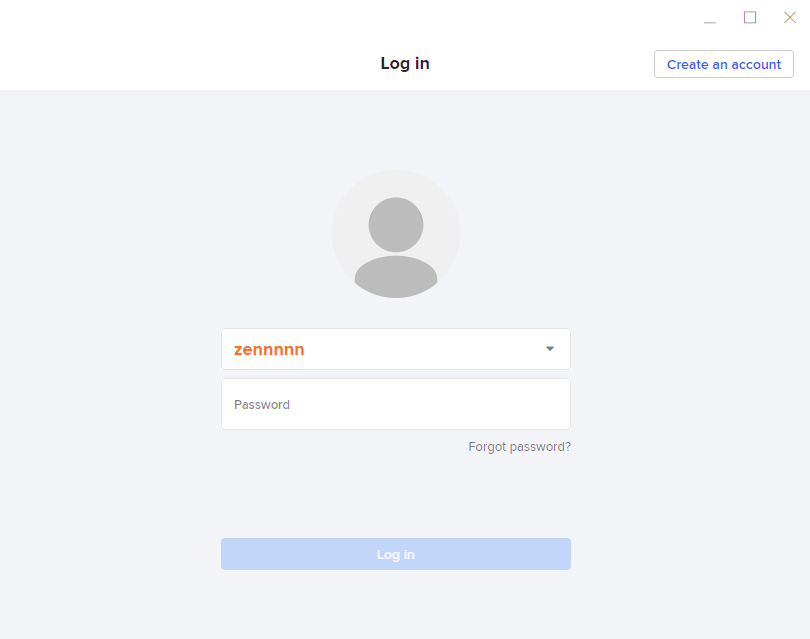

# Upload validators image, website

### Overview

Congratulations on successfully launching the validator node. However, if you want to make an identity with the community, you need to display your own images and a few lines of information, a website. We will guide you below.

### Command

Edit an existing validator's settings, such as commission rate, name, etc.

```text
zenchaind tx staking edit-validator [flags]
```

**Flags:**

| Name, shorthand | type | Required | Default | Description |
| :--- | :--- | :--- | :--- | :--- |
| --commission-rate | float |  | 0.0 | Commission rate percentage |
| --moniker | string |  |  | Validator name |
| --identity | string |  |  | Optional identity signature \(ex. UPort or Keybase\) |
| --website | string |  |  | Optional website |
| --details | string |  |  | Optional details |
| --security-contact | string |  |  | The validator's \(optional\) security contact email |
| --min-self-delegation | string |  |  | The minimum self delegation required on the validator |

### Example

#### Example 1: Edit validator website, details <a id="edit-validator-information"></a>

This command will change the moniker of  **`<your-wallet>`** 

+ Name to **`<New_moniker_name>`**

+ Website to **`abc.com`**

+ Description to **`"This is me"`** text. 

```text
zenchaind tx staking edit-validator --moniker=<New_moniker_name> --website=abc.com --details="This is me" --from=<your-wallet> --chain-id=lotus-testnet 
```


#### Example 2: Edit validator image <a id="edit-validator-information"></a>

1. You need to install keybase to get 16-character identity:
2.  Edit validator identity with command

Step 1: Install keybase desktop application [https://keybase.io/download](https://keybase.io/download)


**Step 2: Create an account**



**Step 3: Upload your image**


**Step 4: Generate code.** 

After creating new account. Access profile and **Add PGP keys,** and you will get 16 chars code. 


**Step 5: Update validator information on-chain**

 After you got 16 char key run this command:

```text
zenchaind tx staking edit-validator --identity=<Replace your 16-char.Ex: D56DC4F99F9370D5> --from
```

**Explorer will update it, and fetch image each** _**15 minutes**_

Result


